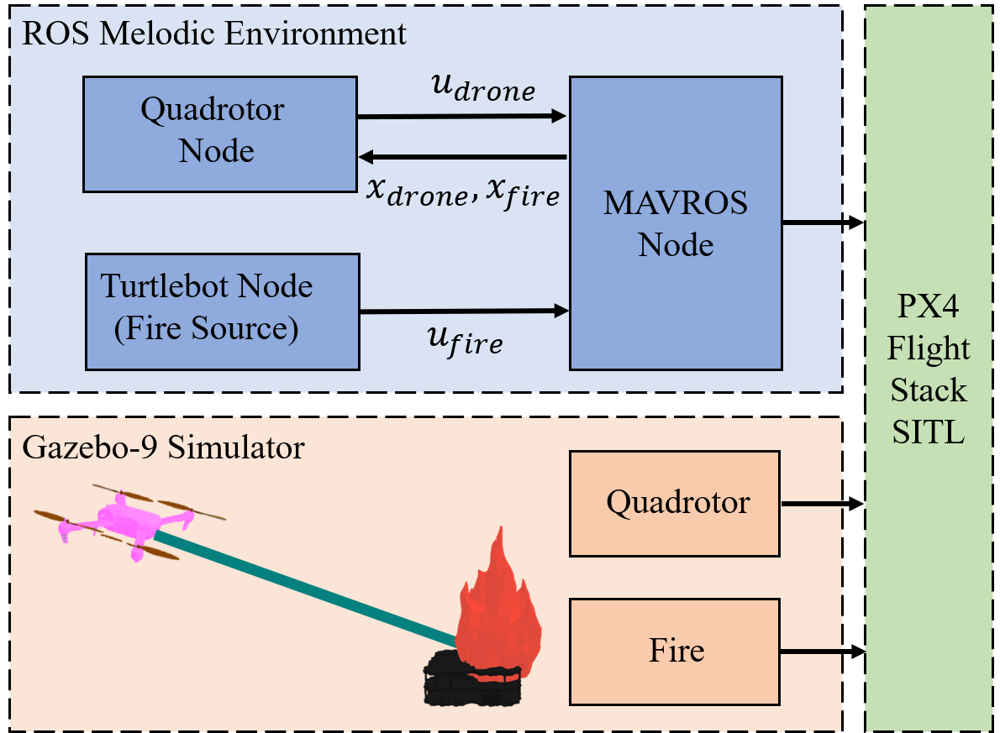
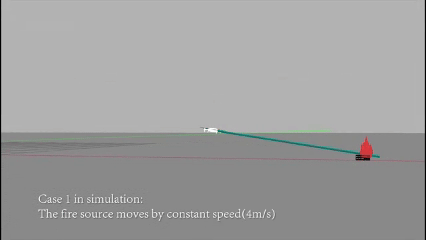
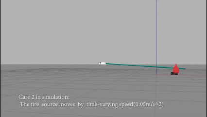

# ARM2022

## Introduction



CTFF is an efficient strategy for continuously targeting and extinguishing moving fire sources with quadrotors, leveraging GPM and SQP for real-time optimal control.

## Simulation Results





This ROS-based simulation demonstrates high computational efficiency ($~0.5ms$/plan) and precise tracking ($<0.1m$ error) for dynamic firefighting scenarios.

## Cite this work

```tex
@inproceedings{chen2022ctff,
  title={CTFF: An Efficient Strategy for Continuously Targeting Fire Fighting with Quadrotor},
  author={Chen, Weihao and Lin, Ziying and Peng, Peng and Dong, Wei},
  booktitle={2022 International Conference on Advanced Robotics and Mechatronics (ICARM)},
  pages={163--168},
  year={2022},
  organization={IEEE}
}
```

